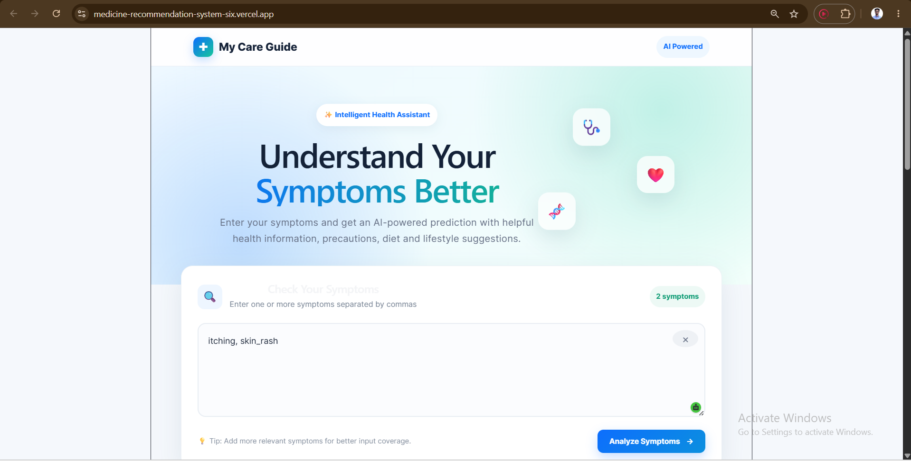
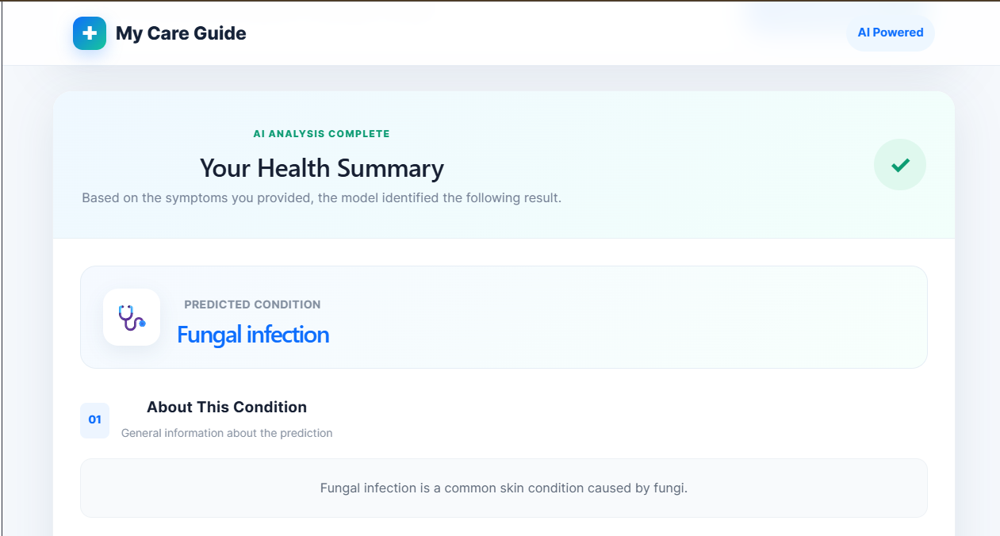
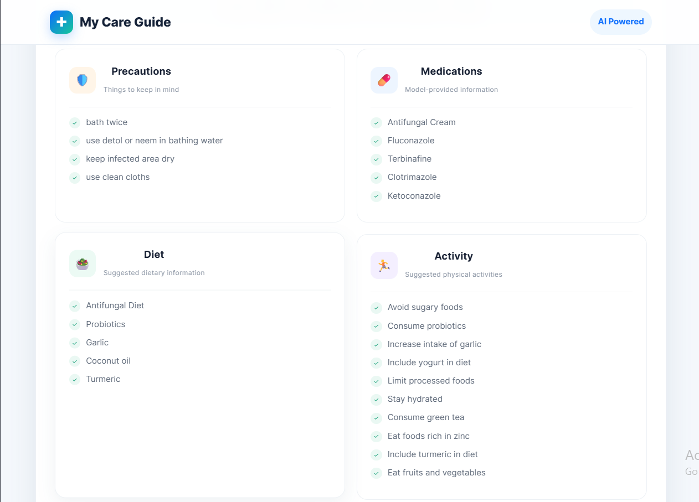

# 🩺 My Care Guide

> **An AI-powered personalized healthcare recommendation system that predicts diseases from symptoms and provides relevant health recommendations.**

My Care Guide is a full-stack machine learning application designed to provide users with a personalized healthcare experience. Users can enter their symptoms through an interactive symptom search interface, receive a predicted disease, and view relevant information such as precautions, medications, diet, and workout recommendations.

> ⚠️ **Disclaimer:** This project is developed for educational and demonstration purposes only. It is not a substitute for professional medical advice, diagnosis, or treatment.

---

## ✨ Features

* 🔍 **Symptom Autocomplete** — Suggests matching symptoms while the user types.
* 🤖 **Disease Prediction** — Predicts a possible disease based on selected symptoms.
* 📋 **Disease Description** — Provides information about the predicted disease.
* 💊 **Medication Recommendations** — Displays relevant medications from the dataset.
* 🛡️ **Precaution Recommendations** — Shows recommended precautions.
* 🥗 **Diet Recommendations** — Provides diet-related recommendations.
* 🏃 **Workout Recommendations** — Suggests relevant physical activities.
* ⚡ **Fast API Communication** — React frontend communicates with the ML backend through REST APIs.
* 📱 **Responsive UI** — Clean and user-friendly interface.

---

## 🏗️ System Architecture

```text
                ┌──────────────────────┐
                │       User           │
                │  Enters Symptoms     │
                └──────────┬───────────┘
                           │
                           ▼
                ┌──────────────────────┐
                │    React Frontend    │
                │                      │
                │ Symptom Autocomplete │
                │        +             │
                │   User Interface     │
                └──────────┬───────────┘
                           │
                       REST API
                           │
                           ▼
                ┌──────────────────────┐
                │    FastAPI Backend   │
                │                      │
                │  Data Processing     │
                │        +             │
                │  ML Model Inference  │
                └──────────┬───────────┘
                           │
                           ▼
                ┌──────────────────────┐
                │   Disease Prediction │
                │        Model         │
                └──────────┬───────────┘
                           │
                           ▼
                ┌──────────────────────┐
                │ Personalized Result  │
                │                      │
                │ Disease              │
                │ Description          │
                │ Precautions          │
                │ Medications          │
                │ Diet                 │
                │ Workout              │
                └──────────────────────┘
```

---

## 🛠️ Tech Stack

### Frontend

* **React.js**
* **JavaScript**
* **HTML5**
* **CSS3**
* **Axios**

### Backend

* **Python**
* **FastAPI**
* **Uvicorn**

### Machine Learning

* **Scikit-learn**
* **Pandas**
* **NumPy**

### Development Tools

* **Git**
* **GitHub**
* **VS Code**

---

## 🔄 How It Works

### 1. Enter Symptoms

The user starts typing symptoms into the search box.

For example:

```text
fev
```

The system dynamically suggests matching symptoms:

```text
Fever
High Fever
Mild Fever
```

The user can select a suggestion instead of manually typing the complete symptom.

---

### 2. Submit Symptoms

The selected symptoms are converted into a list and sent to the FastAPI backend.

Example request:

```json
{
  "symptoms": [
    "fever",
    "headache",
    "vomiting"
  ]
}
```

---

### 3. Disease Prediction

The backend processes the symptoms and passes them to the trained machine learning model.

The model predicts the most likely disease based on the provided symptoms.

---

### 4. Generate Recommendations

After predicting the disease, the backend retrieves the corresponding healthcare information, including:

* Disease description
* Precautions
* Medications
* Diet
* Workout

---

### 5. Display Results

The React frontend receives the API response and displays the information in a structured result card.

---

## 📸 Application Preview

### Page overview




### Disease Prediction Result




### The precaution, medication, diet, and workout related to the disease




### Download the prescription


## 📂 Project Structure

```text
My-Care-Guide/
│
├── backend/
│   ├── app/
│   │   ├── main.py
│   │   └── ...
│   │
│   ├── model/
│   │   └── ...
│   │
│   ├── requirements.txt
│   └── ...
│
├── frontend/
│   ├── src/
│   │   ├── components/
│   │   │   └── Result.jsx
│   │   │
│   │   ├── App.jsx
│   │   ├── App.css
│   │   └── ...
│   │
│   ├── package.json
│   └── ...
│
├── screenshots/
│   ├── home.png
│   ├── autocomplete.png
│   └── result.png
│
└── README.md
```

---

## 🚀 Getting Started

### Prerequisites

Make sure you have installed:

* Python 3.10+
* Node.js
* npm
* Git

---

## ⚙️ Backend Setup

Navigate to the backend directory:

```bash
cd backend
```

Create a virtual environment:

```bash
python -m venv venv
```

Activate the environment on Windows:

```bash
venv\Scripts\activate
```

Install dependencies:

```bash
pip install -r requirements.txt
```

Start the FastAPI server:

```bash
uvicorn app.main:app --reload
```

The backend will be available at:

```text
http://127.0.0.1:8000
```

FastAPI documentation:

```text
http://127.0.0.1:8000/docs
```

---

## 💻 Frontend Setup

Open another terminal and navigate to the frontend:

```bash
cd frontend
```

Install dependencies:

```bash
npm install
```

Start the React development server:

```bash
npm run dev
```

Open the URL shown in the terminal, typically:

```text
http://localhost:5173
```

---

## 🔌 API Endpoint

### Predict Disease

**POST**

```text
/predict
```

### Request

```json
{
  "symptoms": [
    "fever",
    "headache",
    "nausea"
  ]
}
```

### Example Response

```json
{
  "Predicted Disease": "Example Disease",
  "Disease description": "...",
  "Precautions": [
    "...",
    "..."
  ],
  "Medications": [
    "...",
    "..."
  ],
  "Diet": [
    "...",
    "..."
  ],
  "Workout": [
    "...",
    "..."
  ]
}
```

---

## 🧠 Machine Learning Pipeline

The machine learning component follows a typical prediction workflow:

```text
Raw Dataset
     │
     ▼
Data Preprocessing
     │
     ▼
Feature Representation
     │
     ▼
Model Training
     │
     ▼
Model Evaluation
     │
     ▼
Saved ML Model
     │
     ▼
FastAPI Inference
     │
     ▼
Disease Prediction
```

The trained model is integrated into the FastAPI backend so predictions can be generated through an API request.

---

## 🎯 Project Goals

The main goals of My Care Guide are to:

* Make symptom-based healthcare information easier to access.
* Provide an interactive and personalized user experience.
* Demonstrate how machine learning models can be integrated into real-world applications.
* Build an end-to-end AI application using a modern frontend and backend architecture.
* Provide a practical example of deploying machine learning inference through an API.

---

## 🔮 Future Improvements

Potential improvements include:

* [ ] User authentication and personalized profiles
* [ ] Medical history tracking
* [ ] Multiple disease probability scores
* [ ] Explainable AI for disease predictions
* [ ] Large Language Model (LLM) powered healthcare assistant
* [ ] Doctor consultation integration
* [ ] Multilingual support
* [ ] Voice-based symptom input
* [ ] Cloud deployment
* [ ] Mobile application
* [ ] Improved recommendation personalization

---

## ⚠️ Medical Disclaimer

My Care Guide is an **educational machine learning project** and should not be used for self-diagnosis or medical treatment.

The predictions and recommendations provided by the application may be inaccurate or incomplete. Users should always consult a qualified healthcare professional for medical diagnosis, medication decisions, and treatment.

---

## 👨‍💻 Author

**Mahabub Hasan Mamun**

Computer Science & Engineering
University of Dhaka

### Connect

* GitHub: `mahabubmamun`
* Kaggle: `mahabub001cs`
* LinkedIn: `mahabub-hasan-mamun`

---

## ⭐ Support

If you find this project interesting, consider giving the repository a ⭐ on GitHub.
